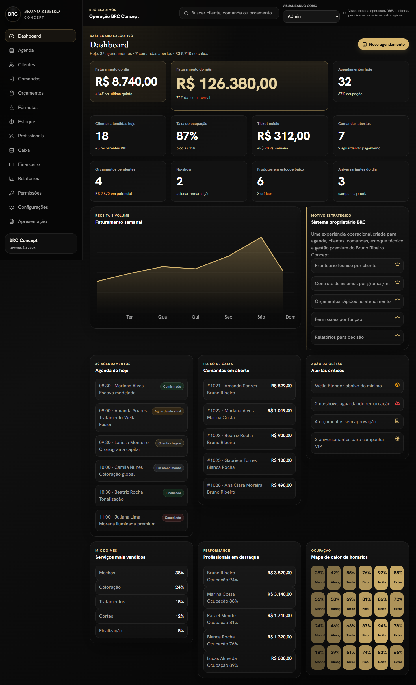
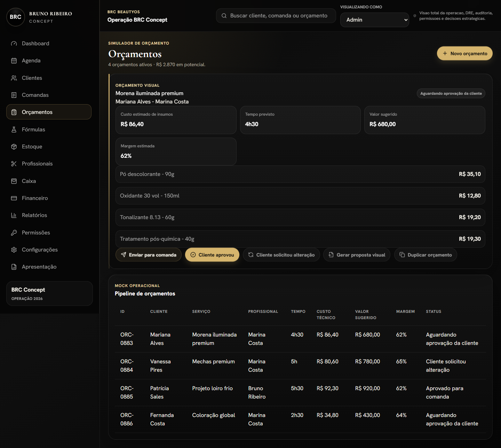
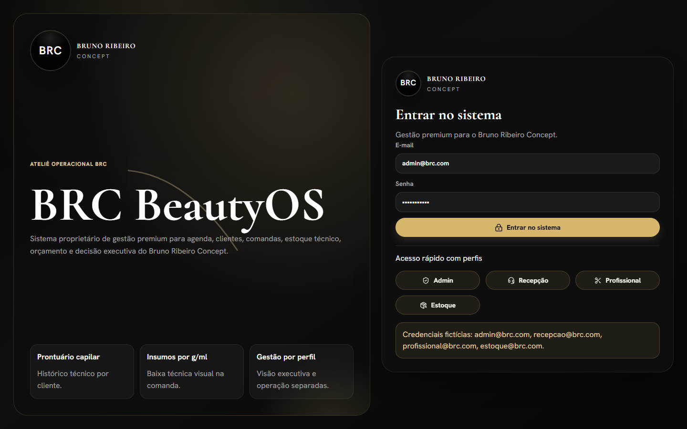
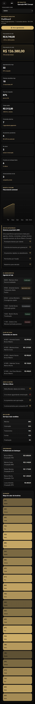

# DOCUMENTACAO DE RETOMADA

Arquivo operacional para retomada do projeto BRC BeautyOS.

Regra permanente solicitada pelo usuario: a cada nova secao, melhoria, ajuste ou mensagem que gere alteracao no projeto, registrar neste arquivo com data e hora, fazer commit automatico e subir para o repositorio GitHub informado:

https://github.com/projetobrc04-sys/SISTEMA-BRC.git

## 2026-07-04 00:00:43 -03:00

### Solicitacao recebida

O usuario informou o repositorio GitHub `projetobrc04-sys/SISTEMA-BRC.git` e determinou que, a cada secao/melhoria do projeto, o trabalho seja documentado neste arquivo com dia e hora, commitado automaticamente e enviado ao repositorio.

### Estado do projeto antes desta documentacao

- Projeto visual beta `BRC BeautyOS` criado em React + TypeScript + Vite.
- Interface premium com identidade BRC em preto, off-white e champagne.
- Rotas criadas: login, dashboard, agenda, agendamento online, clientes, prontuario, comandas, orcamentos, formulas de coloracao, estoque, profissionais, caixa, financeiro, relatorios, permissoes, configuracoes e apresentacao.
- Dados mockados realistas para clientes, profissionais, servicos, produtos, agenda, comandas, orcamentos, financeiro, permissoes e relatorios.
- Fluxos simulados implementados: login ficticio, troca de perfil, permissao visual, check-in, drawer de comanda, checkout visual, modais, filtros, abas e navegacao.
- Build validado anteriormente com `npm run build`.

### Melhoria feita nesta secao

- Criado este arquivo `DOCUMENTACAO DE RETOMADA.md`.
- Criado `.gitignore` para evitar commit de `node_modules`, `dist`, arquivos `.env`, logs e artefatos temporarios TypeScript.
- Preparacao para inicializar Git local, configurar remote GitHub, criar commit e subir o projeto.

## 2026-07-04 00:02:24 -03:00

### Git e repositorio

- Git local inicializado no projeto.
- Branch local configurada como `main`.
- Remote configurado: `https://github.com/projetobrc04-sys/SISTEMA-BRC.git`.
- Commit inicial criado: `30e425d` com a mensagem `Adiciona beta visual BRC BeautyOS`.

### Tentativa de envio ao GitHub

- Comando executado: `git push origin main`.
- Resultado: falhou com erro `403`.
- Motivo informado pelo GitHub: `Permission to projetobrc04-sys/SISTEMA-BRC.git denied to SAMUCA822`.
- Proxima acao necessaria: liberar permissao de escrita para o usuario GitHub autenticado neste computador ou autenticar com uma conta/token que tenha acesso ao repositorio.

## 2026-07-04 00:03:55 -03:00

### Solicitacao recebida

O usuario perguntou se deveria enviar o link SSH e em seguida informou:

`git@github.com:projetobrc04-sys/SISTEMA-BRC.git`

### Acao realizada

- Remote `origin` alterado para SSH: `git@github.com:projetobrc04-sys/SISTEMA-BRC.git`.
- Tentativa de push executada com `git push origin main`.

### Resultado

- Push por SSH falhou com `Permission denied (publickey)`.
- Conclusao: a chave SSH desta maquina nao esta autorizada no GitHub para esse repositorio, ou nao existe chave SSH configurada para a conta correta.
- Estado atual: commits locais existem, mas ainda nao foram enviados ao GitHub.

### Proxima acao necessaria

- Adicionar a chave SSH desta maquina ao GitHub com permissao no repositorio, ou autenticar outra credencial com acesso de escrita.

## 2026-07-04 00:05:02 -03:00

### Solicitacao recebida

O usuario solicitou: `COMITA NO GIT, O QUE FACO PARA VOCER TER ACESSO AO REPOSITORIO?`

### Estado atual

- Todas as alteracoes do projeto foram commitadas localmente.
- Remote atual: `git@github.com:projetobrc04-sys/SISTEMA-BRC.git`.
- Push ainda bloqueado porque o GitHub recusou HTTPS por permissao do usuario `SAMUCA822` e recusou SSH por falta de chave publica autorizada.

### Orientacao para liberar acesso

- Caminho recomendado: adicionar o usuario GitHub `SAMUCA822` como colaborador com permissao `Write` no repositorio `projetobrc04-sys/SISTEMA-BRC`.
- Depois disso, o push podera ser repetido com `git push origin main`.

## 2026-07-04 00:10:41 -03:00

### Solicitacao recebida

O usuario informou que adicionou o colaborador e pediu para verificar se havia permissao e se seria possivel fazer deploy automaticamente toda vez.

### Verificacao de permissao

- Tentativa por SSH continuou falhando com `Permission denied (publickey)`, porque a chave SSH desta maquina nao esta autorizada.
- O remote foi trocado para HTTPS: `https://github.com/projetobrc04-sys/SISTEMA-BRC.git`.
- Push por HTTPS funcionou: a branch `main` foi criada no GitHub.
- Conclusao: a permissao de escrita esta funcionando por HTTPS para o usuario autenticado localmente.

### Melhorias feitas

- Criado workflow `.github/workflows/deploy.yml` para deploy automatico no GitHub Pages em todo push na branch `main`.
- Adicionado `workflow_dispatch` para permitir deploy manual pelo GitHub Actions.
- Ajustado `vite.config.ts` com `base: "/SISTEMA-BRC/"` para funcionar corretamente em GitHub Pages de repositorio.
- Trocado `BrowserRouter` por `HashRouter` em `src/main.tsx` para evitar erro 404 em rotas internas quando hospedado como site estatico no GitHub Pages.
- Criado `public/.nojekyll` para evitar processamento Jekyll no GitHub Pages.

### Observacao operacional

Para o deploy funcionar no GitHub, o repositorio deve estar com Pages configurado para usar GitHub Actions em `Settings > Pages > Source > GitHub Actions`, caso o GitHub nao ative automaticamente pelo primeiro workflow.

## 2026-07-04 00:13:00 -03:00

### Fechamento da secao de deploy automatico

- Build local validado com `npm run build` apos a configuracao de GitHub Pages.
- Commit criado: `8915c37` com a mensagem `Configura deploy automatico no GitHub Pages`.
- Push para `origin main` realizado com sucesso via HTTPS.
- Resultado pratico: o repositorio agora tem workflow de GitHub Actions para build e deploy automatico a cada push na branch `main`.

### Pendencia de verificacao externa

- O GitHub CLI (`gh`) nao esta instalado nesta maquina, entao o status da Action nao foi consultado por CLI.
- Se o primeiro deploy falhar no GitHub, verificar em `Settings > Pages` se a fonte esta configurada como `GitHub Actions`.

## 2026-07-04 00:19:39 -03:00

### Solicitacao recebida

O usuario informou que conectou o Vercel ao GitHub e recebeu o dominio `https://sistema-brc.vercel.app/`, mas a aplicacao aparecia totalmente branca. Pediu verificacao do problema e perguntou se seria possivel conectar com o Vercel.

### Diagnostico

- O projeto estava com `base: "/SISTEMA-BRC/"` no `vite.config.ts`, configuracao correta para GitHub Pages em repositorio, mas incorreta para Vercel no dominio raiz.
- No Vercel, o HTML tentava carregar assets em `/SISTEMA-BRC/assets/...`, enquanto o build do Vercel publica os assets em `/assets/...`.
- Isso explica a tela branca: o JavaScript/CSS principal nao era carregado corretamente no dominio do Vercel.

### Melhorias feitas

- Alterado `vite.config.ts` para `base: "/"`, adequado ao deploy no Vercel.
- Criado script `npm run build:github` com `vite build --base=/SISTEMA-BRC/` para manter compatibilidade com GitHub Pages.
- Atualizado `.github/workflows/deploy.yml` para usar `npm run build:github` no deploy automatico do GitHub Pages.
- Mantido `npm run build` como build padrao para Vercel.

### Resultado esperado

- Proximo push na branch `main` deve disparar novo deploy no Vercel e corrigir a tela branca em `https://sistema-brc.vercel.app/`.
- GitHub Pages continua funcional porque usa o build especifico `build:github`.

## 2026-07-04 00:22:54 -03:00

### Solicitacao recebida

O usuario enviou prints dos logs do Vercel mostrando dois avisos com triangulo laranja e pediu para verificar o que aconteceu.

### Diagnostico

- Aviso 1: `npm warn deprecated recharts@2.15.4`, indicando que a linha 2.x do Recharts nao esta mais ativa.
- Aviso 2: `Some chunks are larger than 500 kB after minification`, indicando bundle grande gerado pelo Vite.
- Ambos eram warnings, nao erros: o deploy completou, mas eram pontos de qualidade que deveriam ser corrigidos.

### Melhorias feitas

- Atualizado `recharts` para a versao mais recente disponivel via `npm install recharts@latest`.
- Atualizado `package-lock.json` com a nova arvore de dependencias.
- Ajustado `vite.config.ts` com `manualChunks` para separar `react-vendor`, `charts`, `icons` e `vendor`.
- Objetivo: remover o aviso de pacote deprecated e reduzir o chunk principal abaixo do limite de warning do Vite.

## 2026-07-04 00:24:55 -03:00

### Validacao das correcoes dos warnings

- `npm run build` executado com sucesso para o build padrao do Vercel.
- `npm run build:github` executado com sucesso para o build do GitHub Pages.
- O warning de `recharts@2.15.4` deprecated foi removido apos atualizar Recharts.
- O warning de chunk maior que 500 KB foi removido apos separar chunks de `react-vendor`, `charts` e `icons`.
- Um warning intermediario de `Circular chunk` apareceu durante a primeira tentativa de chunking e foi corrigido removendo o chunk generico `vendor`.

### Resultado esperado apos push

- Vercel deve fazer novo deploy automaticamente a partir da branch `main`.
- A tela branca em `https://sistema-brc.vercel.app/` deve ser corrigida porque o build padrao voltou a emitir assets na raiz `/assets/...`.
- GitHub Pages continua usando `/SISTEMA-BRC/` por meio do script `build:github`.

## 2026-07-04 00:28:15 -03:00

### Validacao publica do Vercel

- URL testada: `https://sistema-brc.vercel.app/`.
- HTML retornou status `200`.
- Asset principal JavaScript retornou status `200` em `/assets/index-D7bURMk6.js`.
- Confirmado que o HTML usa `/assets/...` e nao usa mais `/SISTEMA-BRC/assets/...` no deploy do Vercel.
- Renderizacao verificada no navegador interno: pagina mostrou `BRC BeautyOS`, botao `Entrar no sistema` e rota `#/login`.
- Conclusao: a tela branca do Vercel foi corrigida.

## 2026-07-04 04:37:05 -03:00

### Solicitacoes recebidas

- O usuario pediu para instalar a skill de loop/autocorrecao para manter o agente iterando ate finalizar.
- O usuario informou o repositorio `pbakaus/impeccable.git` e pediu para instalar junto.
- O usuario informou a skill `freshtechbro/claudedesignskills/.claude/skills/motion-framer/SKILL.md` e pediu para instalar tambem a skill de Framer Motion / Motion UI.

### Melhorias feitas

- Criada e validada a skill `delivery-loop` em `~/.codex/skills/delivery-loop`, com copia user-wide em `~/.agents/skills/delivery-loop` e copia local em `.agents/skills/delivery-loop`, com protocolo de inspecionar, implementar, validar, corrigir, documentar, commitar e subir.
- Instalada e validada a skill `impeccable` a partir de `pbakaus/impeccable`, com copia global em `~/.codex/skills/impeccable`, copia user-wide em `~/.agents/skills/impeccable` e copia local em `.agents/skills/impeccable`.
- Corrigido o frontmatter da `impeccable` para compatibilidade com o validador atual do Codex, movendo `version` para `metadata.version`.
- Adicionado hook local do Codex em `.codex/hooks.json` para executar o detector visual da `impeccable` apos edicoes de UI.
- Criado `PRODUCT.md` com o contexto estrategico do BRC BeautyOS, registrando o projeto como interface de produto, publico, proposito, personalidade de marca, anti-referencias e principios de design.
- Criado `.impeccable/live/config.json` para live mode em projeto Vite/React usando `index.html`.
- Adicionado `.impeccable/live/sessions/` ao `.gitignore` para nao versionar sessoes locais do live mode.
- Instalada e validada a skill `motion-framer` a partir de `freshtechbro/claudedesignskills`, com copia global em `~/.codex/skills/motion-framer`, copia user-wide em `~/.agents/skills/motion-framer` e copia local em `.agents/skills/motion-framer`.

### Validacoes

- `delivery-loop`: `Skill is valid!`.
- `impeccable`: `Skill is valid!` na copia global e na copia local do projeto.
- `motion-framer`: `Skill is valid!` usando Python em UTF-8 na copia global e na copia local do projeto.
- `node .agents/skills/impeccable/scripts/context.mjs` passou a carregar `PRODUCT.md` corretamente e resolveu o projeto como register `product`.
- `node .agents/skills/impeccable/scripts/detect-csp.mjs` retornou `shape: null`, sem CSP a corrigir.
- Build validado com `npm run build`.
- Commit criado e enviado: `d47848c Instala skills de design e delivery loop`.

### Observacao operacional

- Para o Codex reconhecer novas skills globais na lista da proxima conversa, reiniciar/reabrir o Codex apos esta instalacao.

## 2026-07-04 05:04:18 -03:00

### Solicitacao recebida

O usuario colou a analise do Claude sobre a fase atual do BRC BeautyOS: prototipo visual bonito para aprovacao da diretoria, ferramenta interna para equipe, sem pagamento e sem necessidade de banco real nesta etapa. O usuario pediu para instalar todas as skills citadas para reforcar design, shadcn, blocos de UI e boas praticas React/Vercel, preparando a proxima sessao apos reiniciar o Codex.

### Decisao operacional

- Mantida a decisao de nao adicionar backend, banco real, pagamento real ou integracao real nesta fase.
- Supabase foi registrado como opcao futura adequada para login interno e banco quando o projeto sair da demo visual para produto funcional.
- A prioridade continua sendo prototipo visual premium, navegavel, mockado e convincente para a diretoria da BRC Concept.

### Skills instaladas

- `frontend-design`, instalada de `anthropics/claude-code`, caminho `plugins/frontend-design/skills/frontend-design`.
- `ui-ux-pro-max`, instalada de `nextlevelbuilder/ui-ux-pro-max-skill`, caminho `.claude/skills/ui-ux-pro-max`.
- `shadcn`, instalada pela CLI oficial `npx skills add shadcn/ui`.
- `migrate-radix-to-base`, instalada junto pela CLI oficial do shadcn/ui.
- `shadcnblocks`, instalada de `masonjames/Shadcnblocks-Skill`, caminho `skills/shadcn-ui`, com nome normalizado para compatibilidade Codex.
- `react-best-practices`, instalada de `vercel-labs/agent-skills`, caminho `skills/react-best-practices`.

### Onde foram instaladas

- Global Codex: `~/.codex/skills`.
- User-wide agents: `~/.agents/skills`.
- Projeto atual: `.agents/skills`.

### Ajustes de compatibilidade

- `shadcnblocks`: frontmatter `name` ajustado de `Shadcn UI & Blocks` para `shadcnblocks`, mantendo `display_name` em `metadata`.
- `shadcn`: frontmatter `user-invocable` movido para `metadata.user-invocable`, porque o validador atual do Codex aceita apenas chaves padrao no frontmatter.
- Criado/atualizado `skills-lock.json` pela CLI oficial de skills para registrar `shadcn` e `migrate-radix-to-base`.

### Validacoes

- Todas as novas skills foram validadas com `quick_validate.py` usando `PYTHONUTF8=1`.
- Validacao passou na copia global do Codex e na copia local do projeto para: `frontend-design`, `ui-ux-pro-max`, `react-best-practices`, `shadcnblocks`, `shadcn` e `migrate-radix-to-base`.
- Build validado com `npm run build`.

### Observacoes importantes

- A skill `shadcnblocks` esta instalada, mas blocos premium da ShadcnBlocks dependem de API key paga. Nenhuma chave foi criada, solicitada ou gravada.
- O projeto ainda nao foi convertido para shadcn/ui nem recebeu `components.json`; isso fica para a proxima fase, se a decisao for migrar componentes ou adicionar blocos shadcn. Nesta etapa foram instaladas apenas as skills.
- Reiniciar/reabrir o Codex e recomendado para que a proxima sessao carregue automaticamente as novas skills globais e locais.
## 2026-07-04 05:09:26 -03:00

### Solicitacao recebida

O usuario informou que reiniciou o Codex e perguntou se as skills estavam prontas e funcionais.

### Checagem realizada

- Verificada a presenca das skills em `~/.codex/skills`.
- Verificada a presenca das skills locais em `.agents/skills`.
- Rodado `quick_validate.py` com `PYTHONUTF8=1` para todas as skills principais.
- Rodado `node .agents/skills/impeccable/scripts/context.mjs` para confirmar que a skill `impeccable` carrega `PRODUCT.md` e reconhece o projeto como register `product`.

### Resultado

Todas as skills abaixo validaram como `Skill is valid!` na copia global e na copia local do projeto:

- `delivery-loop`
- `impeccable`
- `motion-framer`
- `frontend-design`
- `ui-ux-pro-max`
- `react-best-practices`
- `shadcnblocks`
- `shadcn`
- `migrate-radix-to-base`

### Observacao operacional

As skills estao instaladas e validas. Para uso de design com `impeccable`, a propria skill indicou o proximo passo interno: ler `reference/product.md` antes de produzir qualquer saida visual. O projeto ainda nao foi convertido para shadcn/ui; a skill shadcn esta pronta, mas a migracao/instalacao de componentes fica para uma proxima tarefa.
## 2026-07-04 05:17:17 -03:00

### Solicitacao recebida

O usuario pediu para desinstalar `shadcnblocks` e instalar `aceternity-ui` no lugar, usando o repositorio `https://github.com/secondsky/claude-skills` e o comando `npx skills add https://github.com/secondsky/claude-skills --skill aceternity-ui`.

### Decisao operacional

- `shadcnblocks` foi removida porque trazia dependencia de API key/camada paga para blocos premium.
- `aceternity-ui` foi instalada porque combina melhor com a fase atual de demo visual premium: componentes React animados, Tailwind e Framer Motion.
- Mantida a estrategia: usar `shadcn` para estrutura/base gratuita e `aceternity-ui` para efeitos visuais premium; guardar Kibo UI para fase posterior de dashboard/agenda com logica de estado.

### Mudancas feitas

- Removida a skill `shadcnblocks` de `.agents/skills/shadcnblocks`.
- Removida a skill `shadcnblocks` de `~/.codex/skills/shadcnblocks`.
- Removida a skill `shadcnblocks` de `~/.agents/skills/shadcnblocks`.
- Instalada a skill `aceternity-ui` via CLI oficial `skills`.
- Copiada `aceternity-ui` para `.agents/skills/aceternity-ui`.
- Copiada `aceternity-ui` para `~/.codex/skills/aceternity-ui`.
- Copiada `aceternity-ui` para `~/.agents/skills/aceternity-ui`.
- Atualizado `skills-lock.json` com a origem `secondsky/claude-skills` e skill `aceternity-ui`.

### Validacoes

- `aceternity-ui` validou como `Skill is valid!` na copia local, global Codex e user-wide.
- Confirmado que `shadcnblocks` nao existe mais em `.agents/skills`, `~/.codex/skills` nem `~/.agents/skills`.
- Build local validado com `npm run build`.

### Observacao operacional

A skill `aceternity-ui` esta pronta para a proxima sessao. O projeto ainda nao recebeu componentes Aceternity nem dependencias de runtime como Framer Motion no `package.json`; isso deve acontecer apenas quando for aplicar os componentes na interface.
## 2026-07-04 05:44:03 -03:00

### Solicitacao recebida

O usuario definiu a rodada como evolucao da base atual do BRC BeautyOS para um prototipo visualmente premium, 100% clicavel e pronto para apresentacao da diretoria, sem backend novo. Tambem exigiu uso do `delivery-loop`, auditoria de botoes/links, direcao visual com `frontend-design` e `ui-ux-pro-max`, validacao com `impeccable` contra `PRODUCT.md`, efeitos `aceternity-ui`, microinteracoes com Motion, verificacao `migrate-radix-to-base`, performance com `react-best-practices`, build sem warning novo, commit e push.

### Skills aplicadas nesta secao

- `delivery-loop`: ciclo inspecionar, implementar, validar, documentar, commit e push.
- `frontend-design`: refinamento da direcao estetica premium.
- `ui-ux-pro-max`: geracao inicial de sistema de design e checklist UX; a paleta rosa/lavanda sugerida foi rejeitada por conflito com a identidade BRC.
- `impeccable`: contexto de produto carregado via `PRODUCT.md`.
- `aceternity-ui`: efeito visual premium moderado no hero/agendamento/apresentacao.
- `motion-framer`: microinteracoes em botoes, transicao de pagina e aura animada.
- `shadcn`: mantido como diretriz de composicao para novos componentes internos.
- `migrate-radix-to-base`: verificado; nao aplicavel porque nao havia Radix no projeto.
- `react-best-practices`: aplicado em bundle, imports, animacoes por transform/opacity e componentes reutilizaveis.

### Melhorias feitas

- Instaladas dependencias `motion` e `tailwind-merge`.
- Botao global `src/components/ui/Button.tsx` refeito com `motion.button`, loading visual, hover/tap e foco acessivel.
- Criado `src/hooks/useDemoAction.ts` para simular acoes sem backend com loading, toast e callback local.
- Criado `src/components/effects/PremiumAura.tsx` para aura premium estilo Aceternity, com `prefers-reduced-motion`.
- `AppShell` passou a usar `AnimatePresence` e transicao sutil por rota.
- `BrcHero` recebeu efeito visual premium moderado.
- Ajustado CSS global com microinteracoes, foco visivel, loading spinner, hover premium e aura.
- Corrigidos botoes/links inertes em Dashboard, Agenda, AppointmentCard, CommandDrawer, Commands, BudgetSummaryCard, Clients, ClientProfile, Cashier, ColorFormulas, Financial, Permissions, Presentation, Professionals, Reports, Settings, Stock, OnlineBooking e Header.
- Corrigido HTML invalido na tela de Comandas, removendo botao dentro de botao.
- Criado `AUDITORIA_INTERATIVOS_BRC.md` com lista de achados e resolucao.
- Atualizado `design-system/brc-beautyos/MASTER.md` como fonte de verdade BRC em preto/off-white/champagne.
- Criado `.migration/project.md` registrando que nao havia Radix a migrar.
- Atualizado `README.md` com instrucoes de execucao, build, deploy e documentacao operacional.

### Validacoes realizadas

- `npm run build` executado com sucesso.
- Build Vite final sem warning novo de chunk ou dependencia deprecated.
- Auditoria estatica de interativos executada com `rg '<Button|<button|<Link|<NavLink|role="button"|onClick|to=|href=' src -n`.
- Resultado da auditoria: nao restaram botoes ou links inertes identificados; casos sem `onClick` sao submit, disabled, Link/NavLink com rota ou recebem handler por props.

### Observacoes

- Pagamento, WhatsApp real, banco de dados e autenticacao real seguem fora de escopo.
- A inicializacao formal de shadcn/ui com `components.json` segue para fase futura se o produto passar a consumir registries/blocos diretamente.

### Validacao adicional de deploy estatico

- `npm run build:github` tambem foi executado com sucesso apos repetir fora do sandbox por causa de `spawn EPERM` do esbuild.
- Resultado: build para GitHub Pages validado com `--base=/SISTEMA-BRC/`.

## 2026-07-04 13:06:37 -03:00

### Solicitacao recebida

O usuario pediu uma rodada de refinamento visual para remover assinaturas reconheciveis de UI gerada por IA/Lovable/v0 no BRC BeautyOS, corrigindo antes os bugs reais de sobreposicao no header e na tela de Orcamentos. Escopo mantido front-end only, sem backend, pagamentos, WhatsApp real, banco real ou autenticacao real.

### Skills aplicadas nesta secao

- `delivery-loop`: ciclo de corrigir, auditar, validar, documentar, commit e push.
- `impeccable`: auditoria visual contra anti-padroes e PRODUCT.md.
- `ui-ux-pro-max`: decisao de hierarquia visual, superficies e tipografia editorial/atelie.
- `aceternity-ui`: redirecionamento do efeito visual para fios/luz de beleza em Login/Apresentacao/Agendamento, sem aura generica.
- `motion-framer`: microinteracoes sutis em status, rota e feedback de acao.

### Antes descrito/reproduzido

- Header interno deixava a busca global com cerca de 192px no desktop, enquanto o texto precisava de 279px; isso reproduzia o vazamento/colisao relatado em `Buscar cliente, comanda ou orcamento`.
- Tela de Orcamentos e demais rotas ainda usavam titulos em formato de frase promocional, com leitura de landing page em vez de ferramenta operacional.
- Dashboard tinha cards muito homogeneos e a metrica principal nao tinha peso suficiente.
- Projeto ainda carregava sinais de template/IA: sparkle, aura generica, fonte Inter, gradiente/shimmer em botao principal e badge de beta no menu.
- QA mobile encontrou overflow horizontal em Estoque, Caixa e Financeiro por spans de grid desktop e tabelas largas empurrando a viewport.

### Melhorias feitas

- Corrigido `Header` compartilhado: topbar desktop agora reserva largura real para a busca, aplica truncamento seguro nos blocos laterais e mantem layout proprio para tablet/mobile.
- Corrigida a colisao de Orcamentos e de paginas internas por ajuste global de `content-wrap`, `page-header`, z-index/spacing e validacao em todas as rotas internas.
- Troquei os titulos operacionais para nomes reais de modulo: Dashboard, Agenda, Clientes, Comandas, Orcamentos, Formulas, Estoque, Profissionais, Caixa, Financeiro, Relatorios, Permissoes e Configuracoes.
- Dashboard passou a ter 3 niveis de superficie: KPI primario destacado, KPI acentuado e metricas secundarias neutras; setas de cards nao clicaveis foram removidas.
- Tipografia refinada: `Cormorant Garamond` para wordmark/titulos de destaque e `Hanken Grotesk` para UI/dados, removendo Inter apos alerta da auditoria.
- Removidos sparkle icons, shimmer/gradiente do botao principal, aura generica e badge `Visual beta executivo`/`Beauty experience` do menu.
- Criado `BeautyStrands` como efeito de fios/luz ligado ao universo de beleza, aplicado com moderacao em Login, Hero BRC e Agendamento online.
- Criado componente `Avatar` com iniciais e tons para Clientes e Profissionais.
- Status badges receberam microtransicao com Motion, mantendo telas operacionais sem decoracao pesada.
- Corrigido overflow horizontal mobile em Estoque, Caixa e Financeiro: spans colapsam para uma coluna e tabelas rolam dentro do card.

### Prints depois gerados

- Dashboard desktop: `qa-screenshots/after-dashboard-desktop.png` - mostra busca sem overflow, titulo operacional curto e KPI principal com hierarquia forte.
- Orcamentos desktop: `qa-screenshots/after-orcamentos-desktop.png` - mostra titulo sem colisao com topbar e conteudo subindo para area funcional.
- Login desktop: `qa-screenshots/after-login-desktop.png` - mostra tipografia editorial, botoes sem sparkle e elemento visual de fios/luz.
- Dashboard mobile: `qa-screenshots/after-dashboard-mobile.png` - mostra topbar sem largura horizontal e cards empilhados corretamente.
- Relatorio automatico: `qa-screenshots/visual-qa-report.json`.

### Validacoes realizadas

- `impeccable detect`: retornou `[]`, sem antipadroes detectados apos troca de fonte e limpeza visual.
- QA visual via Chrome/Playwright local: 28 combinacoes de rota/viewport verificadas, `failures: []`.
- Rotas verificadas em desktop e mobile: Dashboard, Agenda, Clientes, Comandas, Orcamentos, Formulas, Estoque, Profissionais, Caixa, Financeiro, Relatorios, Permissoes, Configuracoes e Apresentacao.
- Resultado especifico do bug da busca: desktop passou de 192px para 345px, com `searchSpanClient=279`, `searchSpanScroll=279`, `searchOverflow=false`.
- Resultado especifico de Orcamentos: `topbarBottom=91`, `headerTop=101`, `overlap=false`.
- Resultado mobile: `horizontalOverflow=false` no QA final.
- `npm run build`: sucesso, sem warning novo.
- `npm run build:github`: sucesso, sem warning novo.

### Observacoes

- Login e Apresentacao mantem linguagem de impacto porque sao excecoes autorizadas no briefing.
- Pagamento, WhatsApp real, banco de dados real e autenticacao real seguem fora de escopo.

## 2026-07-04 23:54:19 -03:00
### Solicitacao recebida

O usuario pediu teste completo do site no navegador local, com descoberta de bugs, botoes sem resposta, capturas antes/depois, correcao dos problemas encontrados e nova revisao antes de finalizar. Escopo mantido front-end only, sem backend, banco real, autenticacao real, pagamentos reais ou integracoes reais.

### Skills aplicadas nesta secao

- delivery-loop: ciclo autonomo de auditar, corrigir, retestar, documentar, commitar e subir.
- impeccable: auditoria visual e checagem contra PRODUCT.md.
- motion-framer: preservacao dos feedbacks de clique/loading/microinteracoes existentes.
- vercel-react-best-practices: revisao das alteracoes de estado para evitar cancelamento e renderizacao problematica.

### Bugs e riscos encontrados

- Avisos duplicados podiam receber o mesmo key quando varios toasts eram disparados no mesmo milissegundo, gerando warning React em QA de navegador.
- useDemoAction tinha um unico timer global por componente; ao clicar rapidamente em acoes diferentes, uma acao podia cancelar o feedback visual da outra, fazendo botao parecer sem resposta.
- O deploy local apontava 404 de favicon em console/rede porque nao havia favicon declarado.
- A varredura ampla de 228 interacoes marcou Novo agendamento e Exportar visual como suspeitos, mas os dois foram reproduzidos em teste isolado e passaram; a causa era contaminacao de estado/toast no runner amplo, nao bug do produto.

### Melhorias feitas

- src/state/AppContext.tsx: toasts agora usam ID string com sequencia local, eliminando colisao de key em disparos simultaneos.
- src/hooks/useDemoAction.ts: acoes demo agora mantem multiplos estados pendentes independentes por chave de acao, sem cancelar cliques diferentes no mesmo modulo.
- index.html e public/favicon.svg: adicionado favicon BRC para remover 404 visual/deploy.
- .gitignore: adicionadas pastas locais de QA (qa-temp/ e qa-interaction-screenshots/) para manter prints brutos fora do historico Git e preservar deploy leve.

### Prints e evidencias locais

- Suite guiada final: qa-interaction-screenshots/scenario-final-2-2026-07-05T02-26-53-786Z/.
- Relatorio da suite guiada: qa-interaction-screenshots/scenario-final-2-2026-07-05T02-26-53-786Z/scenario-report.json.
- Resultado da suite guiada: 31 fluxos testados, 0 falhas, 0 console warnings/errors, 0 page errors.
- Varredura ampla bruta: qa-interaction-screenshots/after-strict-final-2026-07-05T02-28-14-763Z/, com 228 interacoes testadas e 2 falsos positivos retestados manualmente.
- Reteste isolado do estoque: qa-interaction-screenshots/stock-export-manual-before.png e qa-interaction-screenshots/stock-export-manual-after.png, confirmando loading e toast Relatorio visual de estoque preparado.

### Fluxos cobertos no navegador local

- Login por formulario e perfil rapido.
- Dashboard: novo agendamento e busca global.
- Agenda: novo agendamento, salvar modal, check-in, drawer de comanda e finalizar pagamento.
- Clientes: nova cliente, salvar cliente, segmentacao de retorno e perfil da cliente.
- Perfil da cliente: aba de historico tecnico e WhatsApp visual.
- Comandas: abrir drawer e selecionar pagamento.
- Orcamentos: aprovar cliente, novo calculo e calcular orcamento.
- Estoque: exportar visual, filtro de criticos, novo item e salvar item.
- Financeiro: gerar DRE visual.
- Relatorios: atualizar periodo.
- Permissoes: novo usuario e salvar usuario.
- Configuracoes: salvar visualmente.
- Apresentacao: iniciar demonstracao.
- Agendamento online: fluxo completo ate confirmar reserva.
- Mobile: menu lateral e ausencia de overflow horizontal no dashboard.

### Validacoes realizadas

- node .agents/skills/impeccable/scripts/detect.mjs --json src: retornou lista vazia.
- npm run build: sucesso.
- npm run build:github: sucesso.
- Chrome/Playwright local: suite guiada final com failures vazio, consoleEvents vazio e pageErrors vazio.

### Observacoes

- A varredura ampla com reload completo por clique foi interrompida porque ficou longa/travada na cobertura de Agenda; nao foi usada como criterio final. O criterio final foi a suite guiada reproduzivel mais retestes isolados dos dois falsos positivos da varredura ampla.
- Os prints brutos foram mantidos localmente e ignorados no Git para evitar adicionar aproximadamente 169 MB de imagens ao repositorio.

## 2026-07-04 23:56:51 -03:00

### Validacao publica apos push

- Commit publicado: f9711d9 - Corrige feedback dos botoes e audita fluxos no navegador.
- URL verificada: https://sistema-brc.vercel.app/#/login.
- Resultado: HTTP 200, React renderizado, texto BRC presente, botao Entrar no sistema presente, consoleEvents vazio e pageErrors vazio.
- Print local salvo em qa-interaction-screenshots/public-login-after-push.png.

### Observacao

- A Vercel esta entregando a tela de login publicada; nao reproduzi tela branca nesta checagem.